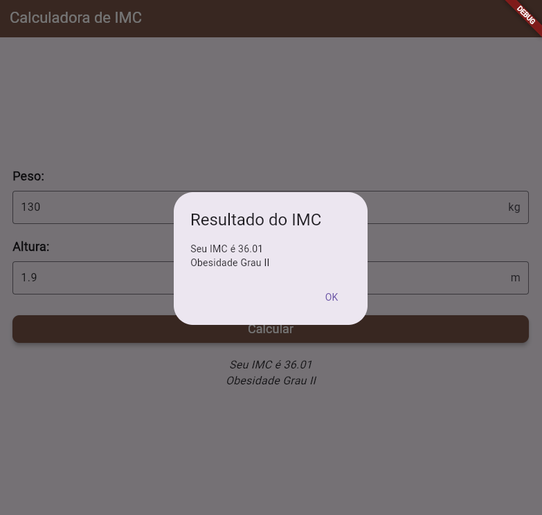

# Avaliação IMC
Feito no dia 06/06/2025


## Descrição do Projeto
O Avaliador de IMC é uma ferramenta simples e prática para quem busca monitorar a saúde e o peso corporal. Ele permite que o usuário calcule rapidamente seu Índice de Massa Corporal com base em duas informações essenciais: o peso e a altura.

Basta inserir o seu peso (em quilogramas) e sua altura (em metros). O avaliador então calcula e exibe o seu IMC e, mais importante, categoriza o resultado em faixas de saúde. Essa funcionalidade ajuda o usuário a entender se seu peso está adequado para sua altura, indicando se está abaixo do peso, com peso normal, sobrepeso ou obesidade. É uma ótima forma de visualizar de forma rápida a sua situação atual e, se necessário, buscar orientação profissional.

## Prints



## Tecnologias Utilizadas:

- Flutter
- Dart
- vsCode
- Firebase Studio


## Como executar:
- Clone este repositório
- Abra com VsCode ou Android Studio, com um terminal instale as dependências e execute no emulador ou navegador
```bash
flutter pub get
flutter run
```
